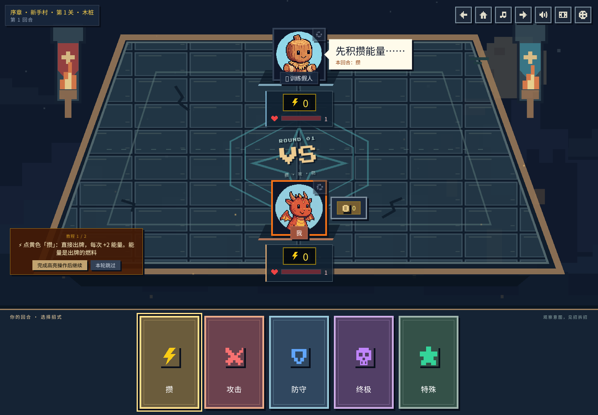
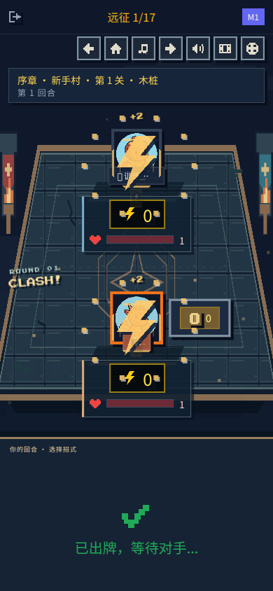

# Battle stage and effects

Adds a pixel stone arena with banners, fire bowls, breathing runes, embers, round signage, player plinths and framed status panels. The hand shelf has a phase-aware heading.

Revealed moves trigger finite effects keyed by turn and card: charge particles gather inward, defense displays a shield, attacks create crossed slashes, and ultimates add violet shockwaves alongside the existing character cut-ins. Damage events create short local impact bursts. All decorative layers ignore pointer input. The in-game reduced-motion setting prevents move/hit effects from mounting; system and in-game reduced-motion styles stop ambient animation.

## Previews

## Validation

ESLint, production build and all 69 existing tests passed. Chromium checks at 1440px and 390px verified the arena layout. In the live local expedition flow, the highlight bounds remained stable, charge rendered effects for both participants, and attack completed the first tutorial battle and opened rewards. Mobile document width stayed at 390px. Live multiplayer was not exercised; game rules and room networking are unchanged.
