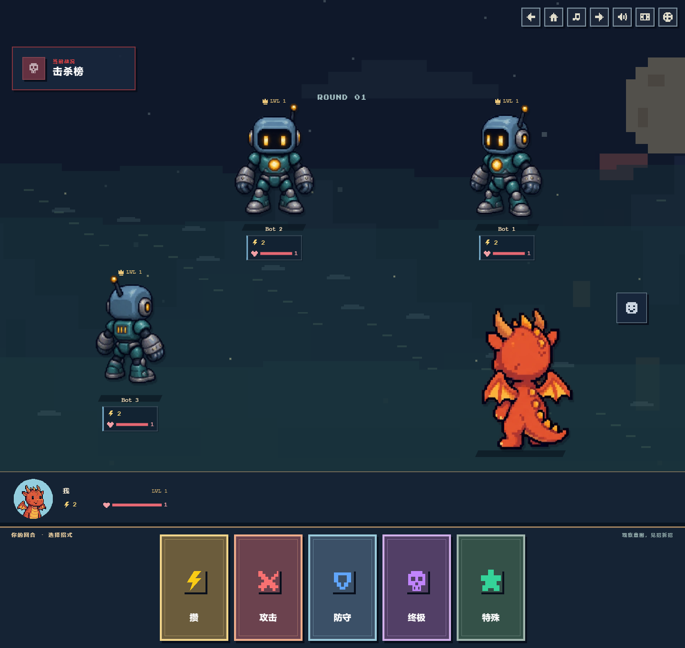
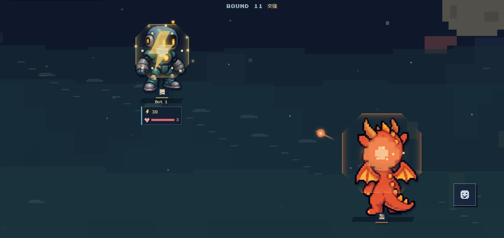

# 开放式战场、角色排布与逐卡特效

移除中央战斗桌面和棋盘边框，使用月夜像素空地。四人局采用远处两名、左侧近景一名、右下方玩家背影的构图；五至八人扩展为前后错开的站位。角色随视口放大，保留头像对应的八方向模型、机器人与远征敌人形象、轻微待机起伏和独立的手牌区头像。

战斗顺序为「亮牌 → 技能特效 → 命中反馈」：在角色身前展示卡面、名称与费用约 650ms，再切换为技能演出。全部 61 张技能（含联合技）都有明确的特效配置：火焰、冰晶、斩击、星光、枪弹、护盾、毒雾、吸收等 17 类像素图形，逐卡区分配色、亮色、粒子数量与强度。进攻技能从施放者飞向射程内角色；防御和辅助技能在角色身边呈现。等级终极技亮牌后播放现有立绘演出，再播放场上特效。远征与多人结算均为亮牌留出时间；房主的减少动画偏好不会缩短其他客户端的演出。

命中反馈取自本回合结算后的真实血量变化：短促后仰、像素闪光、血条高亮和伤害数字。被防住或闪避不会伪造掉血；致命伤也能播放反馈，胜负界面延后 700ms 显示。系统及游戏内减少动态效果时保留静态技能名和伤害数字。

## 验证

- 87 项测试、TypeScript、ESLint、生产构建通过。
- Chrome 检查 77 组布局：2–8 人，3627 / 1920 / 1440 / 1024 / 768 / 600 / 390 / 320px；远征 1–3 名敌人和意图气泡。未发现角色互相覆盖、气泡挡住角色、顶部状态栏遮挡或横向溢出。小屏幕纵向滚动保留完整角色与手牌。
- 61 张技能均用实际组件渲染；验证八人同时释放的 56 条进攻轨迹、真实伤害、格挡、闪避、致命反馈、胜负弹层延时、终极演出衔接、320px 英文技能名以及减少动画。
- 在 1440px 和 390px 使用真实远征逻辑完整完成三课，每轮施放与结算均显示特效，奖励和商城流程可继续。
- 复查四选一、升级解锁预览、悬停、键盘、触屏、320×480 短屏、英文、购买和金币扣除。窄屏通过信息按钮查看奖励详情，避免鼠标悬停时遮挡相邻选项。

[布局记录](validation.json) · [特效与教程记录](effects-validation.json) · [奖励交互记录](reward-validation.json)

多人检查使用本地模拟房间状态渲染真实页面，未建立 Firebase 多客户端联网会话；只调整演出等待时间，战斗判定、AI 和网络协议未变更。预览图只用于文档，不加入游戏资源加载。WebP 图片使用无损压缩。

## 预览

[超宽屏四人布局](players-4-3627.webp) · [手机四人布局](players-4-390.webp) · [八人布局](players-8-1440.webp) · [320px 八人布局](players-8-320.webp) · [远征多人](expedition-4-1440.webp)

[技能释放前的亮牌](card-reveal-1440.webp)

[冰系终极技](ice-ultimate-1440.webp) · [实际命中反馈](hit-feedback-1440.webp) · [八人同场施放](eight-player-casts-1440.webp) · [61 张技能特效图鉴](all-skill-effects.webp)
