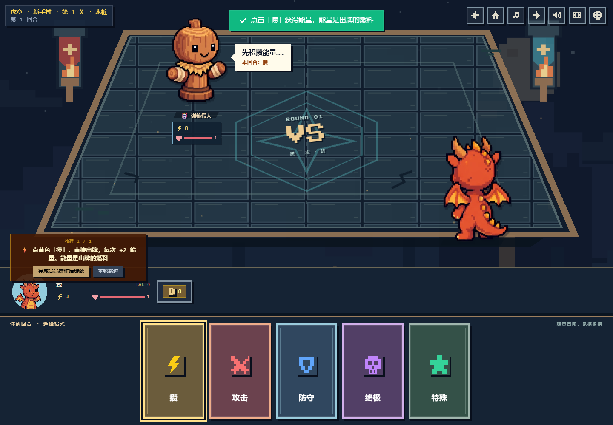
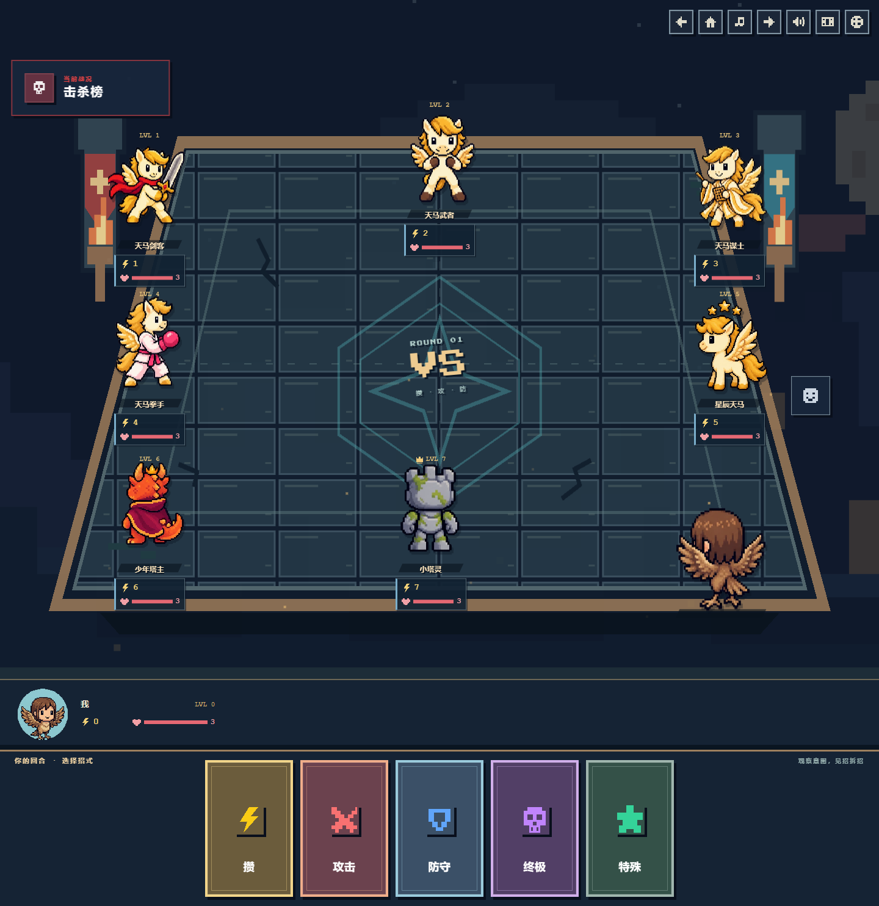

# 头像对应的八方向战斗视角

自己站在桌子右下方，显示当前所选角色朝向桌心的背身形象。其他玩家按相对座位选择正面、侧面或斜向视图；八人场景覆盖全部八个方向。移除了场上头像容器的边框与裁切，保留原像素擂台、色彩和招式效果。

头像、姓名、等级、血量、能量及远征物品栏集中在手牌栏上方左侧。按后续要求放大了角色和头像区：桌面单挑己方角色容器宽 240px，手机 136px；头像区为 92px / 72px。多人场景根据密度缩放，并增加战场高度，窄屏允许纵向滚动。

## 角色和动态

- 全部 13 个可选头像各有独立八方向图集：小火龙、少年、少女、牛头人 NTR、天马、鸟身人 RSN、天马剑客、天马武者、天马谋士、天马拳手、星辰天马、少年塔主、小塔灵。训练木桩也有独立图集。
- 每张图集 4 列 × 2 行，1536 × 1024，顺序为南、西南、西、西北、北、东北、东、东南。少年塔主的西北单元在显示时水平翻转，以纠正生成素材的朝向。
- 轻微 4px 待机起伏、出招前探与受击抖动只作用于场上形象。系统和游戏内“减少动态”均停用角色位移动画；阵亡角色不再起伏。
- 其他远征敌人沿用原画像，去除外层 UI 框；它们尚未新增八方向图集。自定义或无法识别的头像回退为自己的原画像，不会变成另一位角色。新加入的机器人从现有头像池选择形象。
- 现有头像和选项未替换。新图集保存在 `public/characters/`，只加载当局用到的文件，兼容 GitHub Pages 子路径。

## 预览

[390px 远征](expedition-390.png) · [320px 八人布局](multiplayer-320.png) · [320px 三敌人意图](three-enemies-320.png)

## 验证

此处截图用于记录角色与桌面布局。教程后续已改为手牌上方的三课引导，最新页面及完整流程验证见 [教程优化](../tutorial/README.md)。

- 使用仓库原有 `package-lock.json` 安装依赖；TypeScript、ESLint、生产构建和 73 项测试通过（原有 69 项，加 4 项素材映射与座位方向测试）。
- Chromium 检查 1440、768、390、320px 单敌人及八人界面：图片加载正常、无页面横向溢出；八人角色状态区无相交或裁切。
- 检查全部 13 个头像的实际战斗映射；八个座位的朝向分别为 NW、SE、S、SW、E、W、NE、N。
- 1440、390、320px 三敌人意图气泡无其他角色遮挡；姓名支持截断与完整悬浮标题。
- 实测教程：攒 → 双方招式效果 → 攻击分类 → 轰 → 通过木桩关卡 → 奖励。角色动画期间头像区和手牌位置不变；系统减少动态时角色静止。
- 多人页面使用本地浏览器内模拟玩家验证，不代表真实 Firebase 多客户端联机验收。没有更改房间协议、Firebase 配置或战斗数值。
- 保留现有构建的 JS 分块大小提示。此次 PR 不自动合并；合并后主分支的既有部署工作流才会发布。

## 素材生成

使用内置 ImageGen 工具，以每个已有头像为身份参考生成图集，然后编码为 WebP，保留尺寸和透明通道。完整共用提示与角色约束见 [art-prompts.json](art-prompts.json)。最初生成的通用背身草稿未接入项目。
