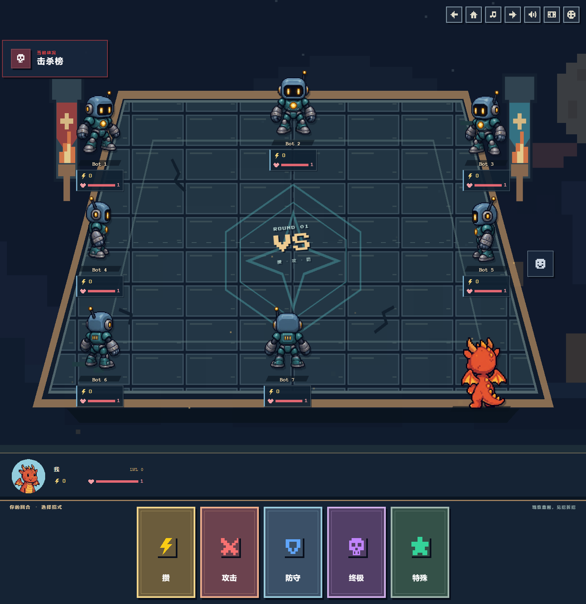
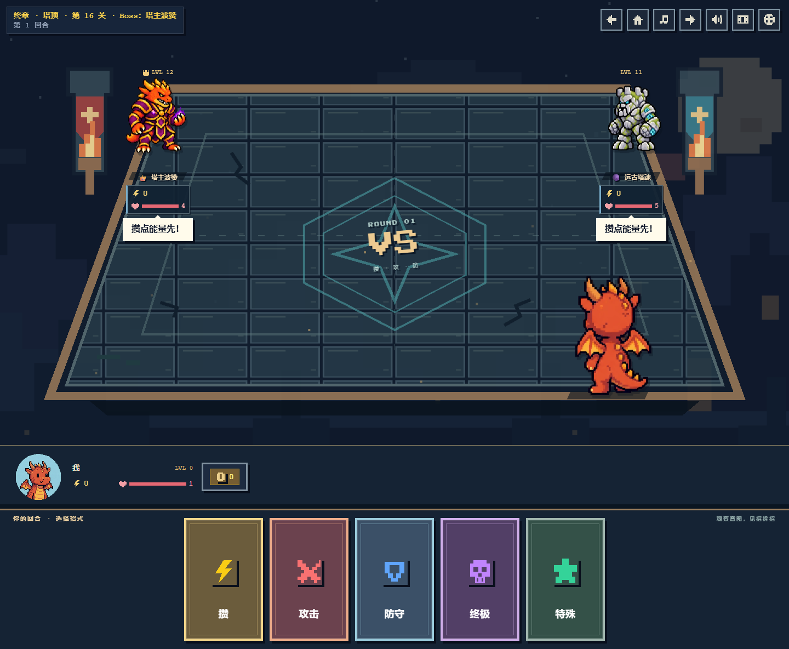

# 机器人与远征角色

多人房间的机器人使用独立的蓝灰色机器人头像和人物模型，包括已有房间中保存旧头像或没有头像的机器人。真人继续使用自己选择的角色；远征敌人保留各自的身份。

远征全部 23 种敌人都有完整八方向模型：复用训练木桩，为其余 22 种敌人新增图集。头像不变，战场按座位展示正面、侧面、背面或斜向视角，沿用待机起伏、出招和受击动画。减少动态偏好可关闭位移动画。

图集统一为 1536 × 1024、4 列 × 2 行，单格 384 × 512，顺序为 S、SW、W、NW / N、NE、E、SE。个别生成格的左右方向由显示层翻转校正。模型只加载当局实际使用的图集；资源支持 GitHub Pages 子路径。两个 Boss 的宽体模型补足透明间隔，避免跨格串图。

## 机器人策略

机器人根据公开的血量、能量、楼层、技能与上一回合动作，为候选出牌模拟 16 种对手响应，使用游戏本身的战斗结算比较生存、击杀、能量和走位。会储能破防、利用飞行闪避或破碎反制、避免射程外浪费攻击，并考虑混战中的其他机器人。多个招式在所有采样中都获胜时优先选择低费用招式。

决策先清除所有未公开的当回合选牌，保留公平性；相同公开局面和回合得到稳定结果，避免房间事务重试改变选择。均衡、进攻、稳健三种倾向显示在营地。远征自身的性格、Boss 被动和教程出招脚本保持原有规则。

## 验证

- TypeScript、ESLint、82 项测试、生产构建通过。测试覆盖隐藏出牌隔离、输入不可变、费用与封印、破防、闪避、反制、射程、混战和全部模型映射。
- Chromium 检查 23 种远征敌人、三暗影、三守卫、双 Boss、七机器人同场、旧机器人头像兼容、营地头像和减少动态。
- 覆盖 1440、768、390、320px；检查图片加载、横向溢出、角色相交、关卡信息遮挡与敌人气泡相交。详细结果见 [validation.json](validation.json)。
- 本地桌面运行八个装备多种技能的机器人决策约 277ms，仅为本机观察值。真实 Firebase 多客户端联机与低端移动设备耗时尚未验证。
- 保留现有构建的 JS 分块大小提示。PR 未自动合并或部署。

## 页面预览

[手机七机器人](robots-320.png) · [手机三暗影](shadow_a-320.png) · [机器人营地头像](lobby-320.png)

使用内置 ImageGen，以原头像为参考生成完整角色，保留透明通道编码为 WebP；机器人头像单独生成，身份与模型一致。提示及资源记录见 [art-prompts.json](art-prompts.json)。
