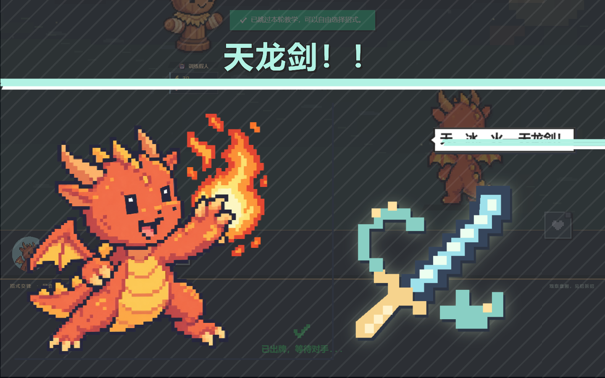

# 联合技能过场

天龙剑、双翼齐飞、三大金刚、轰天轰地轰、诛心毒气，现在与等级必杀一样先亮牌，再播放全屏立绘、技能名与喊话，随后衔接场上特效和真实结算反馈。五种组合分别使用剑光、展翼、金刚护阵、连环爆破和毒雾演出；标题显示「联合技 / COMBO」，不显示内部使用的等级 100。

沿用现有像素角色立绘，新增原生 SVG 像素徽记，也用于对应手牌的卡面。所有参与演出的玩家保留独立画面；五至八人同时出招时压缩标题区并隐藏喊话气泡。远征和多人模式共用过场资格判断，并为完整演出留出结算时间。技能的伤害、射程、类型和组合条件不变。

## 验证

- 89 项测试、TypeScript、ESLint、生产构建通过。覆盖全部等级必杀和联合技、混合排序、阵亡排除、中英文与普通技能的原有短演出。
- 使用真实远征操作逐个打出五个联合技，确认「亮牌 → 过场 → 场上特效 → 结算」，均在约 5 秒后继续下一轮；双翼齐飞使用 390px 手机视口。
- 1440 / 390 / 320px 渲染八人同时使用五个联合技和三个等级必杀，标题与身份文字未超出各自画面，没有横向溢出。
- 检查英文、立绘加载失败后的徽记与文字回退、游戏内减少动画和系统减少动态效果。
- 浏览器没有运行错误。多人验证使用本地模拟房间状态，未建立 Firebase 多客户端联网会话。

[验证记录](validation.json) · [此前的战场与逐卡特效](../battle-spacing/README.md)

## 预览

截图全部来自虚构的本地测试角色，仅用于文档；使用无损 WebP 压缩，不增加游戏资源下载。

[双翼齐飞（手机）](doublewing.webp) · [三大金刚](vajra.webp) · [轰天轰地轰](allbomb.webp) · [诛心毒气](heartpoison.webp)

[八人同屏](mixed-eight-1440.webp) · [390px 八人同屏](mixed-eight-390.webp) · [320px 八人同屏](mixed-eight-320.webp)
