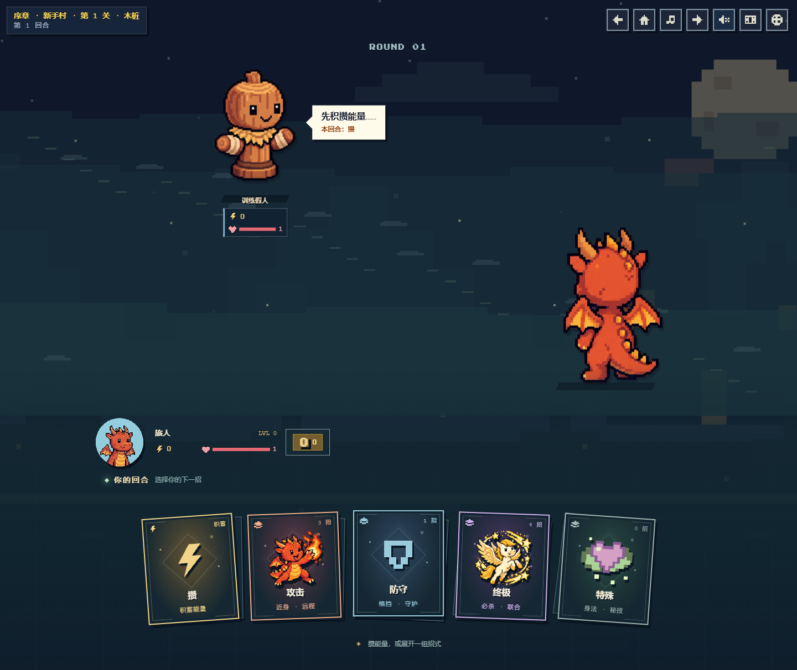
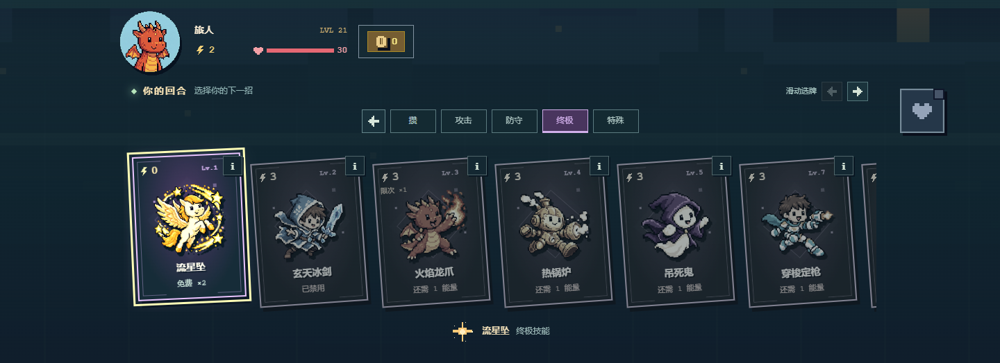

# 与战场衔接的手牌区

手牌区延续月夜空地的蓝绿色前景，移除原来两条硬分隔线和整块不透明底板。头像、状态、物品与手牌共用前景背景；头像保持在手牌左上方。

- 分类改为有像素插画、叠放边框和轻微扇形错落的卡组，悬停或键盘聚焦时抬起。
- 实际手牌放大技能图案，显示名称、能量费用、免费次数、限次次数与不可用原因。长说明移至下方悬停/聚焦预览，触屏可用独立的 `i` 按钮打开详情，打开详情不会出牌。
- 展开卡组后可直接切换分类；长牌列支持横向滑动和左右按钮，避免把所有牌挤到同一屏。键盘进入分类后聚焦第一张卡，关闭详情返回原来的信息按钮。
- 提交招式后保留所选卡牌，并显示等待或施放状态；下一回合恢复可操作手牌。教程高亮、出牌条件、免费和限次规则沿用现有逻辑。

## 验证

- 89 项现有测试、TypeScript、ESLint 和生产构建通过。
- Chrome 检查 1440 / 768 / 390 / 320px：五类卡组、长牌列首尾、左右浏览、键盘聚焦和出牌、详情弹窗及焦点恢复、禁用和能量不足保护、免费与限次标记、减少动画。四种宽度均实际打出免费必杀，确认过场、结算、免费次数消耗和下一回合恢复；未发生横向页面溢出。
- 1440px 和 390px 使用新手牌完整完成三课教程及奖励、商城流程。验证教学中的错误卡牌被拦截，以及 320×480 短屏详情、空分类和阵亡状态。
- 八人模式使用本地模拟房间状态渲染，未建立 Firebase 多客户端联网会话。战斗规则、AI、网络协议和战场站位未变更。

[手牌验证记录](validation.json) · [教程与边界状态记录](tutorial-validation.json)

## 预览

全部截图来自本地虚构测试角色，仅用于文档，不加入游戏资源加载。WebP 使用无损压缩。

[手机手牌](categories-390.webp) · [手机详情](details-mobile.webp) · [320px 英文](english-320.webp) · [已出招状态](locked-move.webp)
