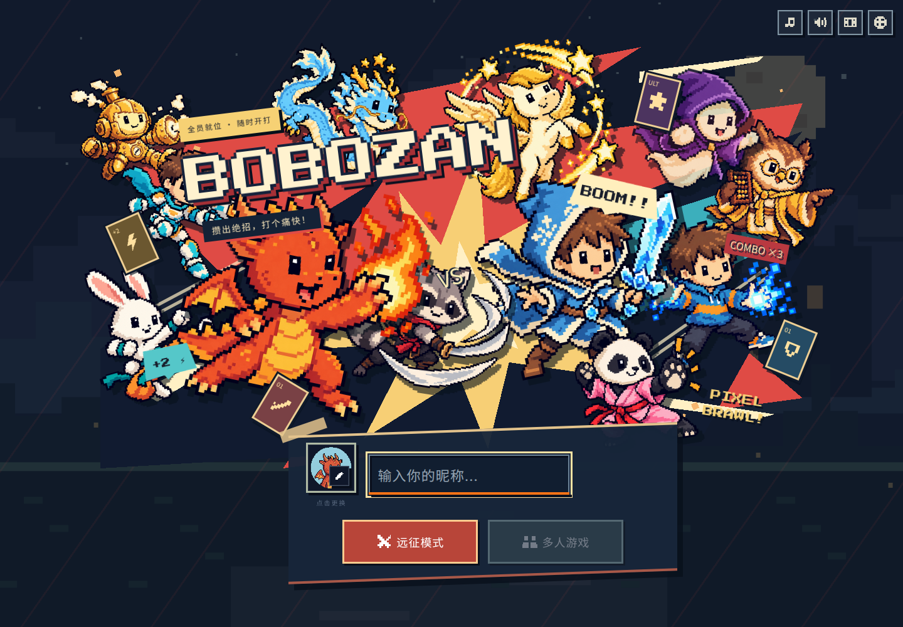
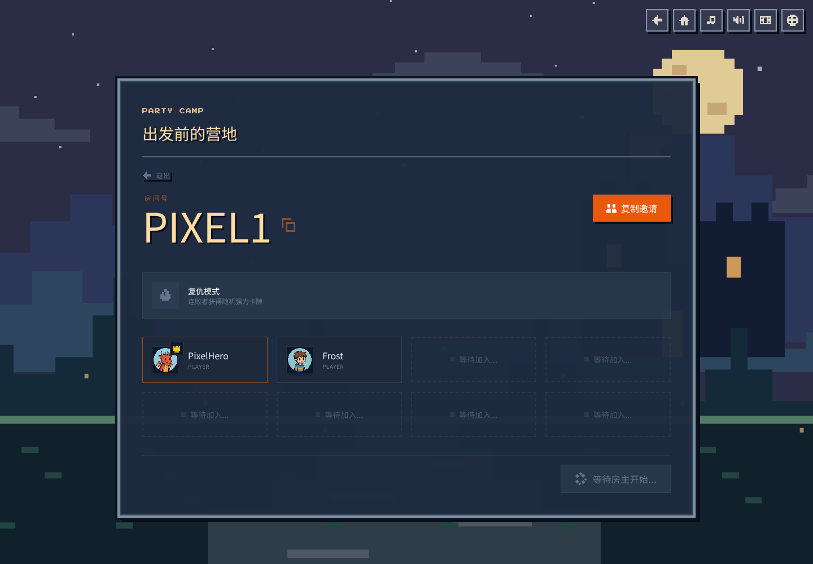
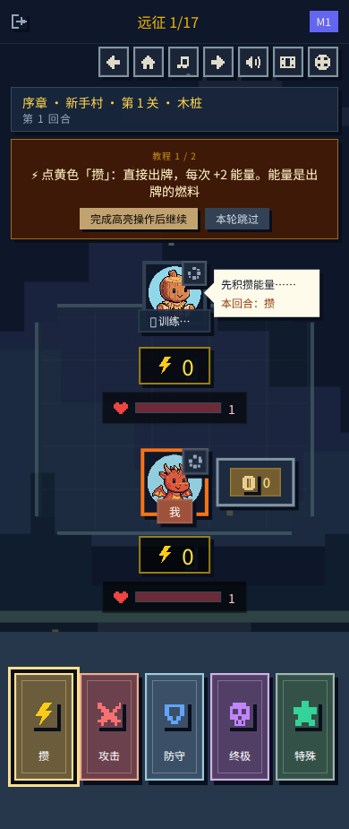
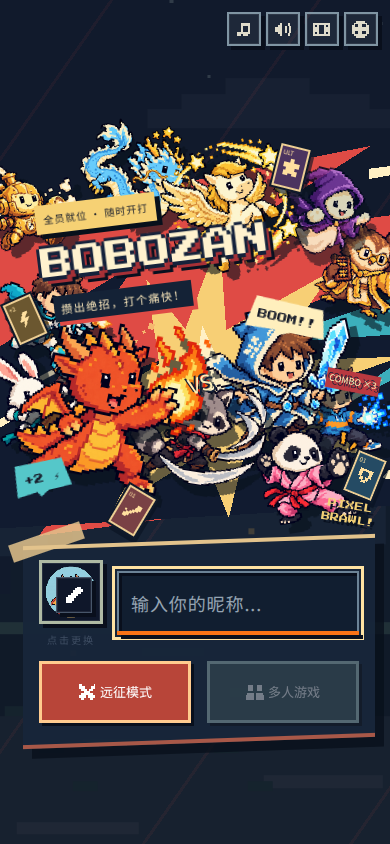

# Pixel UI overhaul

The title screen, multiplayer home, lobby, battle arena, cards, inventory, rewards and shop share a pixel RPG visual system. Existing character art is reused for the title party and the corresponding level/skill cards. Icons and the four background moods are local, integer-grid SVG; the bundled Press Start 2P display font includes its OFL license.

- Hard borders, solid panels, stepped shadows and category colors replace glass panels and rounded controls.
- Clouds, stars, fireflies and title characters animate in steps. System reduced-motion and the existing in-game setting stop decorative movement.
- Interactive cards stay still. Tutorial highlighting uses an outline without moving or blocking its target.
- Card shelves scroll horizontally when necessary; all five categories fit on mobile. Mobile tutorial and battle content occupy separate layout space.
- Cards support Enter/Space activation and visible keyboard focus. Modal content can scroll on short screens.

## Preview

## Validation

- ESLint, TypeScript/Vite production build, and all 69 existing tests passed.
- Chromium screenshots checked at 1440px, 390px and 320px; title and lobby had no document-width overflow.
- Played the first expedition tutorial: Charge → Attack → Blast → victory → reward → shop. Highlight bounds stayed unchanged during an 800ms sample. No broken images in the tested expedition state.
- Lobby preview uses local simulated players. Live multiplayer was not exercised because the local environment has no Firebase deployment configuration. No Firebase configuration, room protocol or game balance changes are included.
- Chinese screenshot rendering used a local test font because the headless test environment lacks CJK fonts. The product uses the visitor's system Chinese font and bundles only the small Latin display font.

## Brawl cover revision

The title screen now uses an asymmetrical ensemble composition: twelve existing fighters at different scales and depths, a diagonal logo, red/cyan torn shapes, impact rays and comic callouts. The entry panel has skewed decorative edges while its actual controls remain stationary and accessible. No reference artwork is shipped with the game.

Rechecked 320px/390px/1440px layouts, loaded images, multiplayer navigation and expedition entry in Chromium. ESLint and production build passed. Decorative fighter movement also respects the existing reduced-motion rules.
