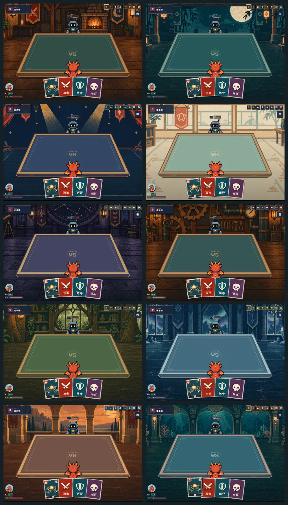

# Selectable world themes

The battle previously paired woodcut cards with an unrelated stone-grid table and pixel skyline. Ten illustrated scenes now share a quiet felt table, engraved rim and themed interface colors. Woodcut Tavern is the default. The four-square control opens a thumbnail gallery from the title, lobby or battle, and saves the choice on this device.

1. Woodcut Tavern
2. Moonlit Courtyard
3. Midnight Theatre
4. Paper Conservatory
5. Star Observatory
6. Copper Workshop
7. Forest Library
8. Crystal Hall
9. Sunset Arcade
10. Coral Palace

Backgrounds contain only environments. Players, seat geometry, table cards, hand controls and actions remain live components. New scenes decode before replacement; failed requests leave the current scene visible, and the most recent selection wins. Unknown stored themes fall back to the tavern.

Eleven basic cards use the approved simpler symbol/hand illustrations. The attack, guard and ultimate folders have no cost/level badges. Actual skill cards still render cost and level from live game data; acquired art, holographic finishes and translucent apricot ultimate effects are retained.

Validation: 292 logic/config/audio tests; TypeScript, lint and production build; all ten themes; six viewport sizes; 2–8 players; reload persistence, storage-unavailable behavior, failed-image retry and rapid switching. Card details, live level/free cost, reduced motion, aura hit testing and natural one-tap charge/attack flows were checked. Screenshots use fictional local players.

See [QA results](qa-summary.json). The short phone landscape layout continues to scroll vertically. Viewport emulation does not replace a physical iPad Safari check.

Generation prompts are saved with the [scene assets](../../../public/themes/woodcut-v1/manifest.json) and [simplified card assets](../../../public/cards/woodcut-v2/manifest.json). Production backgrounds plus thumbnails total approximately 2.14 MB; only the chosen full-size scene is requested initially.
