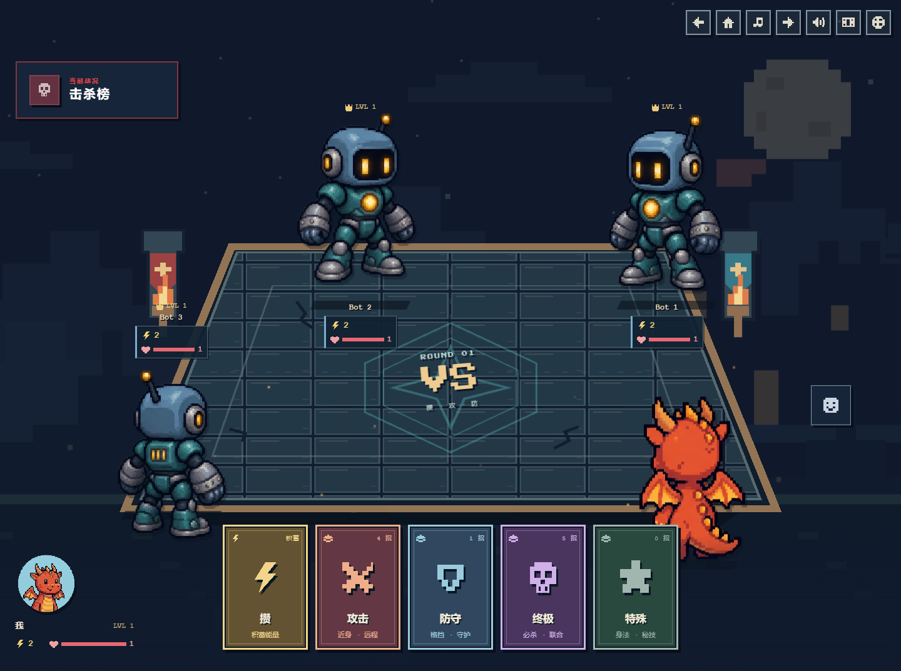
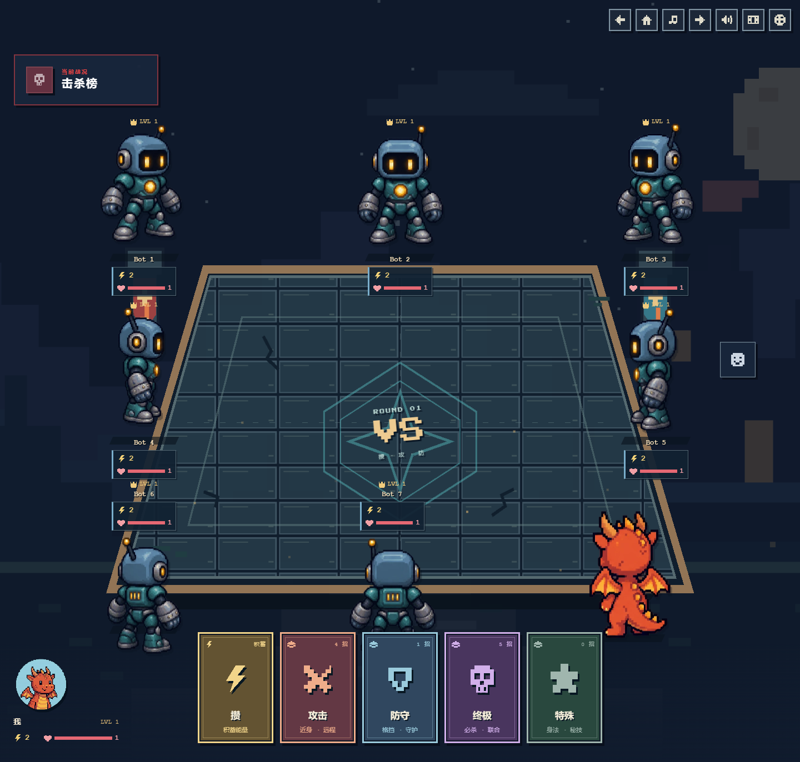
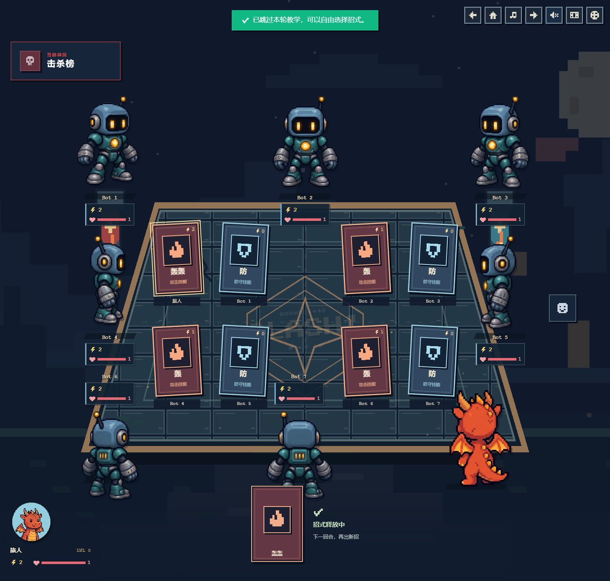
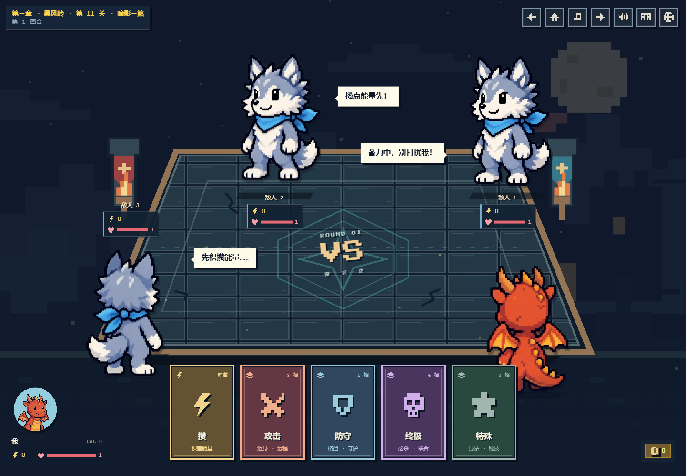
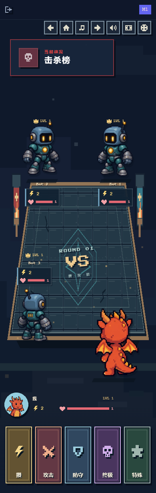
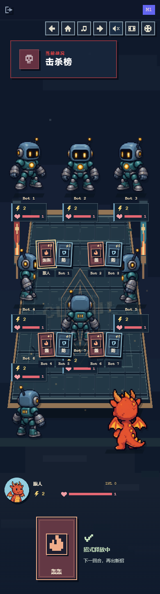

# 围桌出牌预览

保留现有头像对应的人物模型、八方向朝向、轻微待机动画和受击反馈。战桌回到画面中央，角色放大后围桌排列；手牌作为前景覆盖桌前，头像状态位于左边，金币与物品位于右边。移除“你的回合 / 选择下一招”，恢复平铺的彩色分类卡牌。

普通出招改为卡牌飞入桌面、落桌强调和回合结算，不再播放角色周围的技能图形或飞行弹道。必杀技与五种特殊组合的过场保留，减少动画设置下仍能直接看见桌面出牌。

多人机器人在存活对手有能量时，扩大评分相近的合法招式之间的随机选择；保留固定种子、隐藏出牌隔离、费用限制和确定胜利时优先省能量的策略。

## 验证

- 构建、ESLint 和 90 项自动测试通过。
- 77 种本地布局：多人 2–8 人、远征 1–3 个敌人，320–3627 px 宽；无横向溢出、角色碰撞、裁切或意图气泡遮挡。
- 1440 / 768 / 390 / 320 px 手动交互自动化：全部手牌分类、键盘导航、详情弹窗与焦点恢复、禁用/能量不足限制、免费和限次卡、真实必杀技演出及结算。
- 桌面与手机完成三关教程、奖励和商店；320 × 480 矮屏详情、空分类和阵亡状态通过。
- 五种宽度检查 8 张桌面出牌、两排无相互遮挡、排除阵亡角色、减少动画设置和右侧物品提示。
- 多人使用本地模拟房间状态验证展示；未连接 Firebase 进行多客户端实战。

记录：[布局](validation.json)、[卡牌展示](card-validation.json)、[教程](tutorial-validation.json)。

## 截图

仅包含本地虚构测试角色；WebP 为逐像素校验的无损预览。

