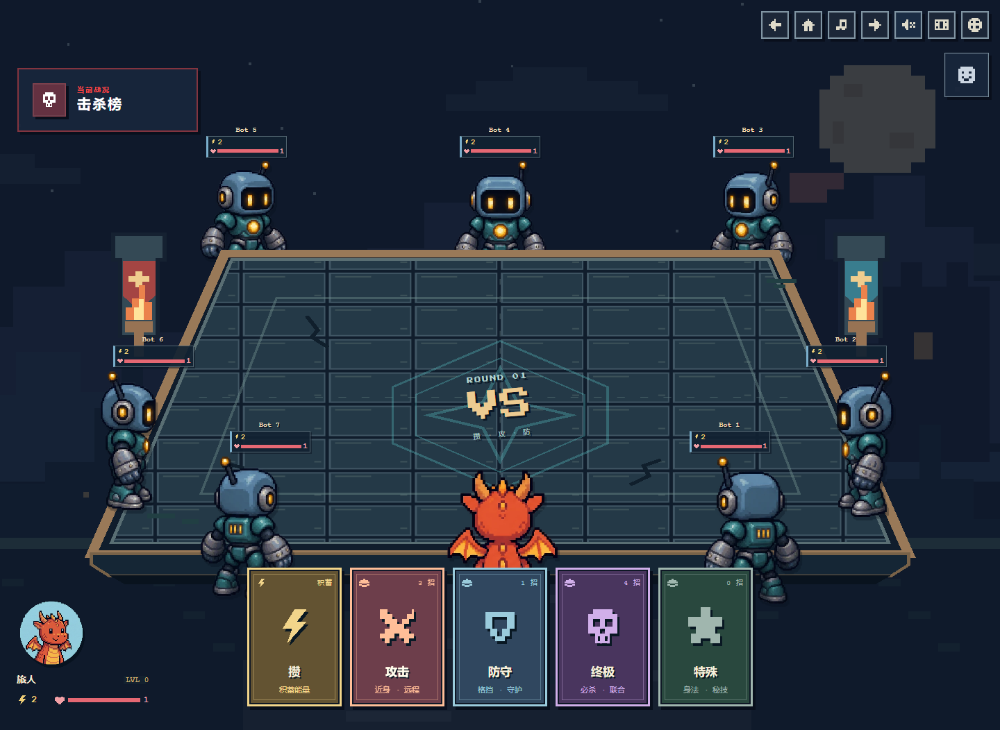
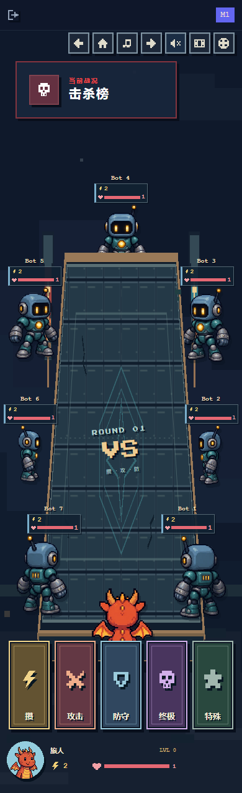
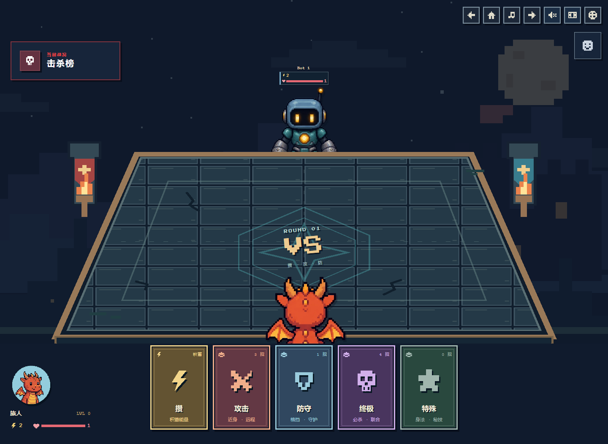
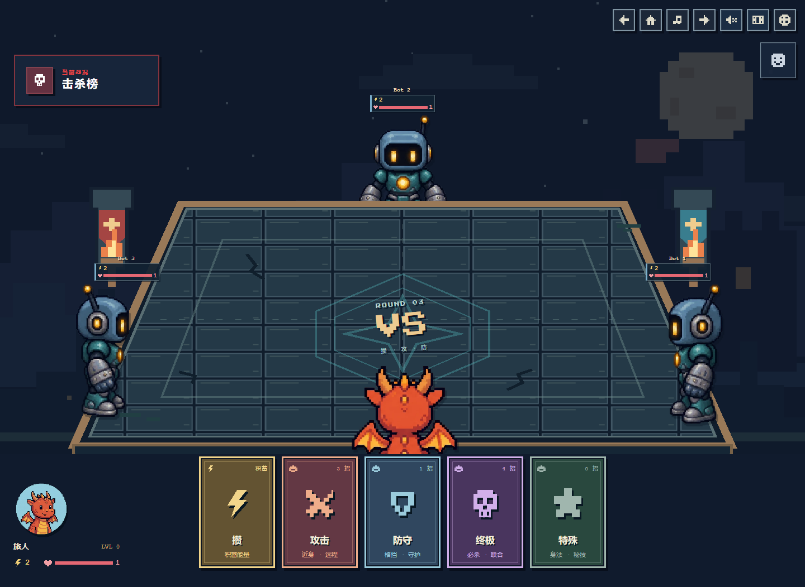
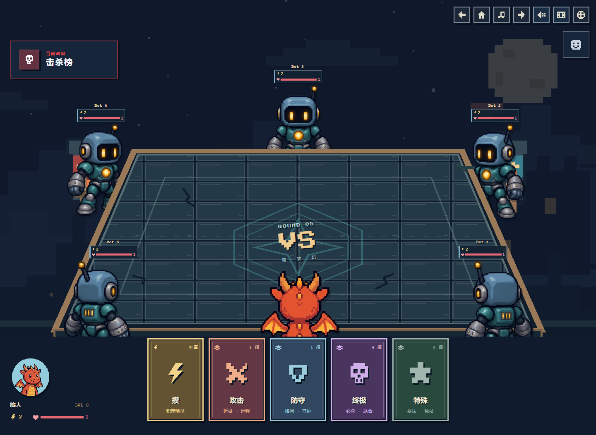
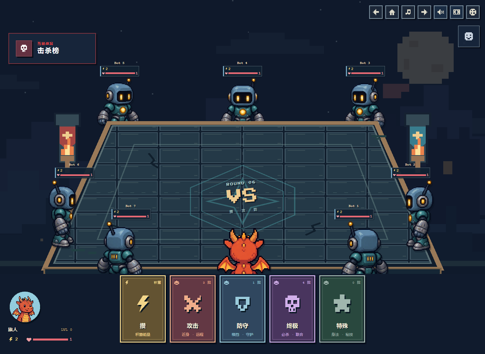
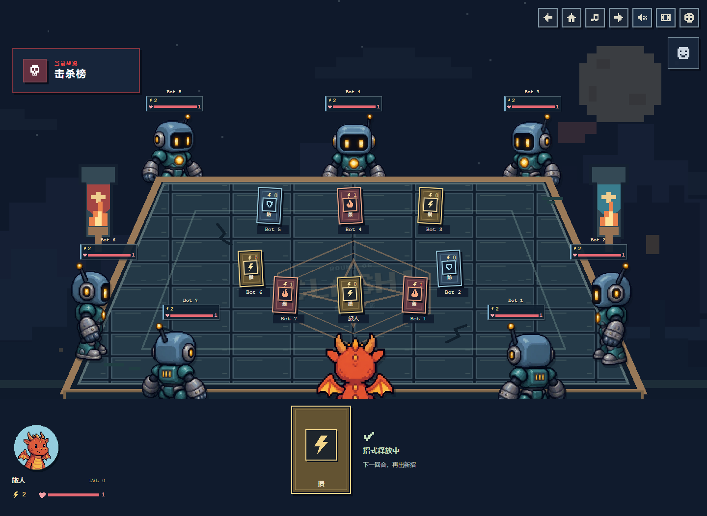
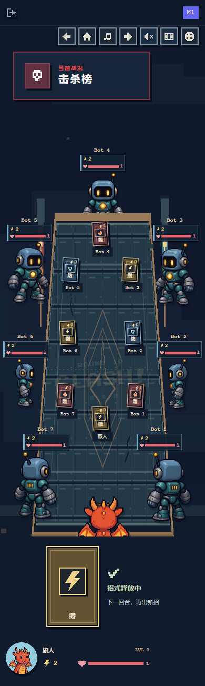

# Table depth and seat-owned cards

Based on the live 2D square-table version at `a1d227d00ab9740541fc1b91a259e2a94ab82f1d`.

Characters now sit around the table at waist height. The local player stays front-center, closer to the near edge, with their upper body visible above the hand. Far and side characters move slightly outside the corresponding edge and render behind the table, keeping their upper bodies clear of the tabletop. Near-side characters overlap the near rim. Status labels and intent bubbles stay above the scene.

The hand dock and scrollbar track are transparent, so the same battle scenery continues behind the cards. The cards themselves still cover characters naturally; gaps and the single-card showdown state reveal the scene beneath. Card faces, controls and their interaction layers remain unchanged.

The table extends upward and has a thicker front edge. Played cards form a smaller, perspective-correct square inside the table, with a fixed slot corresponding to each roster seat. A dead player or a player without a card leaves an empty slot; the other cards retain their positions and tilt.

The leaderboard scrolls with the scene header so it no longer covers characters when viewing the hand on a shorter screen. Its expand and drag controls remain available.

## Previews

These are actual browser captures with local fictional players. The current pixel art, eight-direction character models, hand cards and game rules are retained.

Latest transparent-hand previews:

Earlier table-layer captures, before removing the dock background:

## Validation

The transparent-hand follow-up passed a production build and browser checks with 2 and 8 players at 1440×1000, 1024×768, 844×390, 390×844 and 320×700: transparent backgrounds, scene coverage, category/skill clicks, details and focus restoration, showdown cards, and no horizontal overflow. See [transparent-hand-validation.json](transparent-hand-validation.json). The broader checks below were completed for the preceding table-layer implementation.

- All 100 unit tests, lint and production build passed.
- 126 browser states: 2–8 players in PLAYING and SHOWDOWN at 1440×1000, 1920×1080, 1200×900, 1199×900, 1024×768, 844×390, 768×1024, 390×844 and 320×700. Checked visible character portions, actual layer ordering, statuses, played cards, controls and page overflow.
- 54 partial/dead-player cases retained the same card slots and tilt.
- 63 high-stat layouts: energy 120, HP 9.5, elevation 3 and level 23.
- 25 expedition intent/tooltip cases and five hand-interaction viewport sizes passed, including a real local ultimate cast and settlement.
- All three tutorial lessons completed on desktop and mobile, including rewards and shop continuation. Empty/dead-player hands and details were checked on a short 320×480 screen.
- All 13 selectable avatar designs were checked in desktop and phone eight-seat scenes. Opaque head pixels remain clear of the table, and the local character exposes more upper-body pixels above the hand.
- Leaderboard scrolling, double-click expand/collapse and dragging passed at four screen sizes.

These checks use local Chromium viewport simulations, not a physical-device or online multi-client Firebase test. Compact results are in [validation.json](validation.json).
