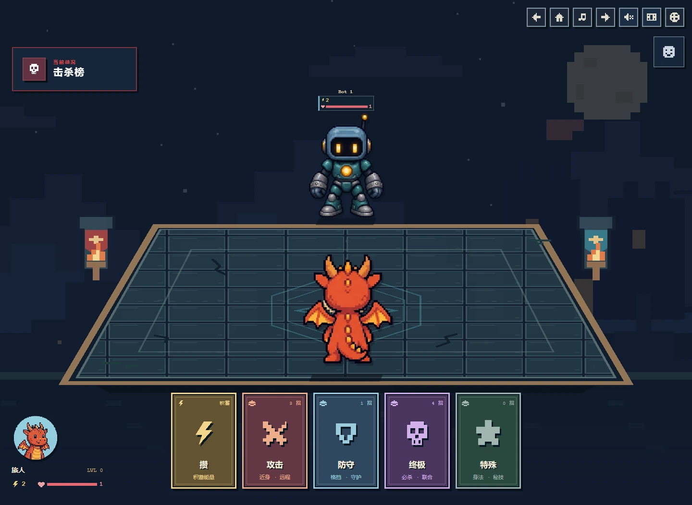
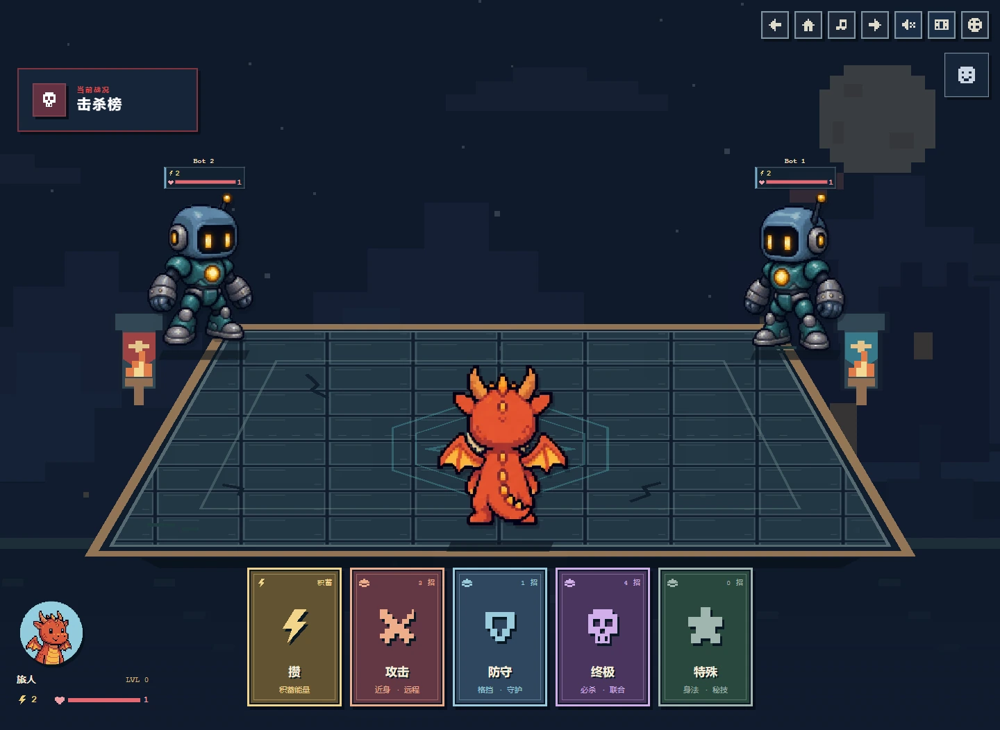
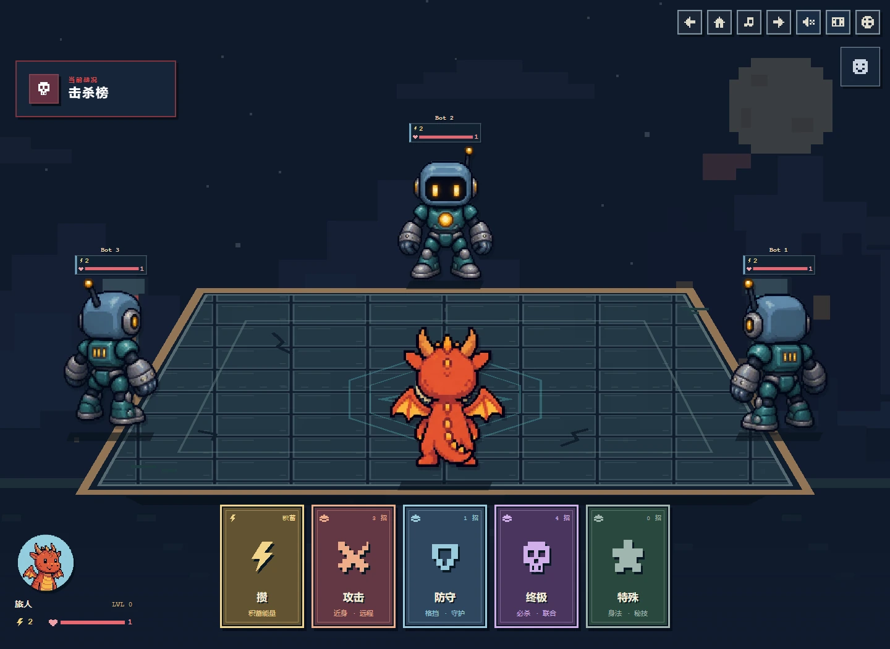
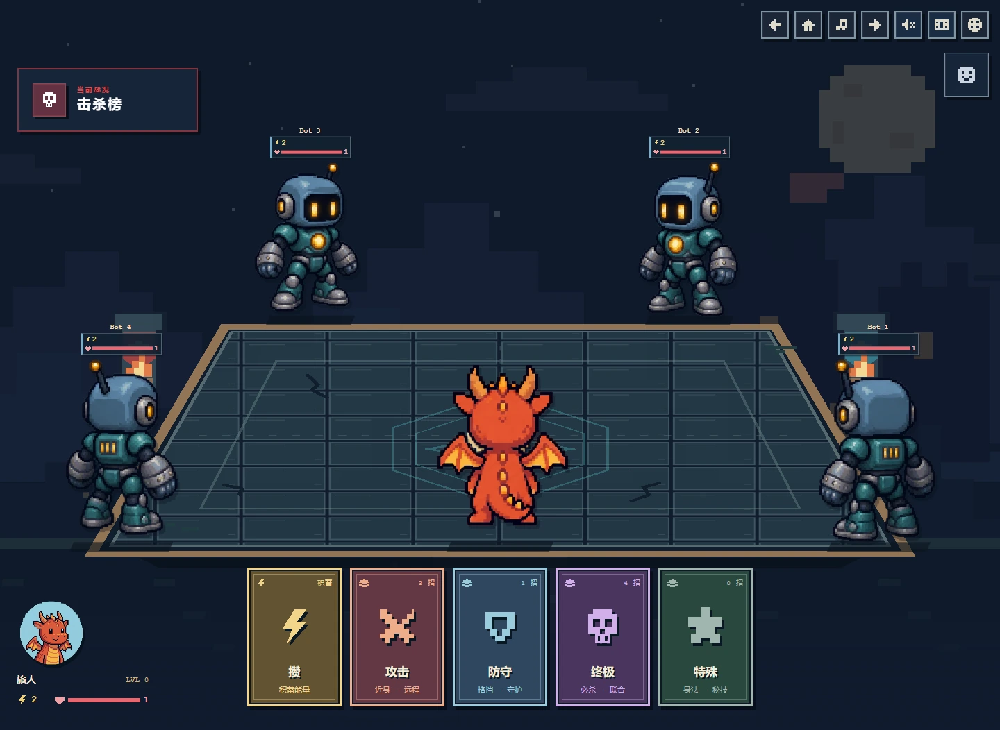
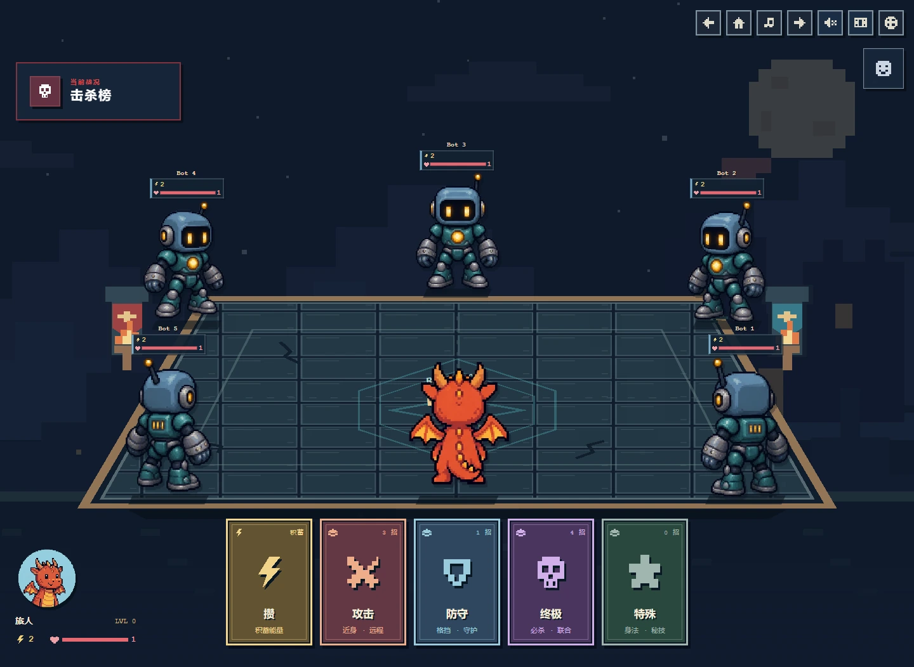
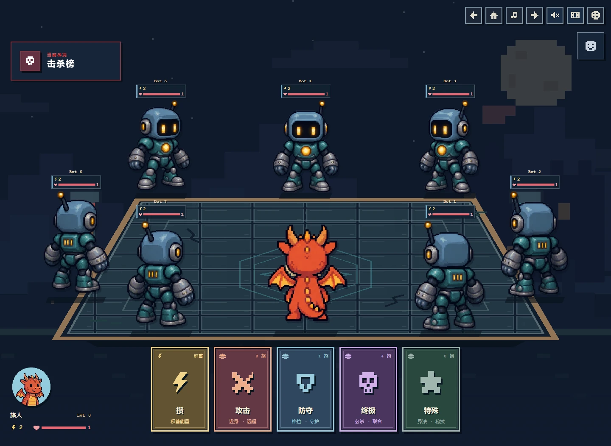
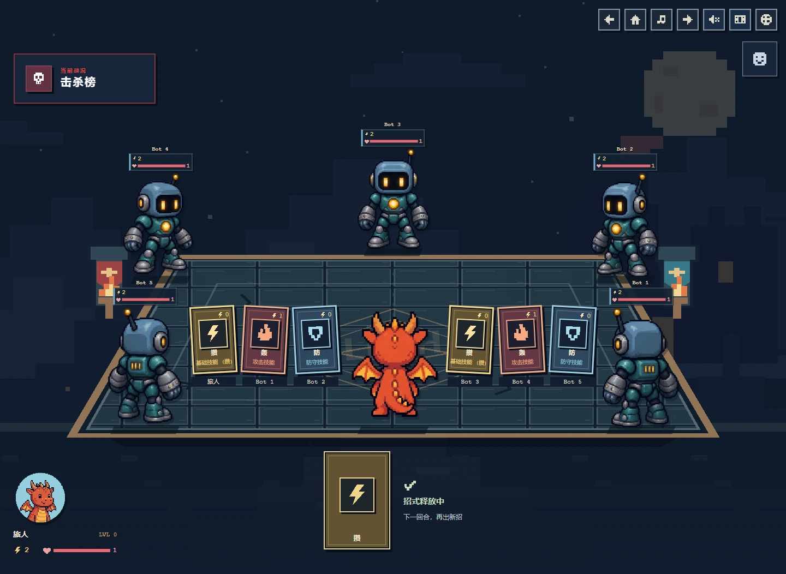
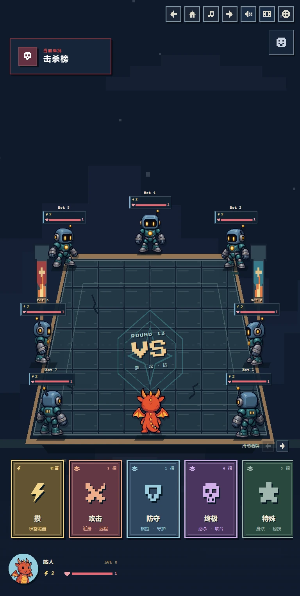
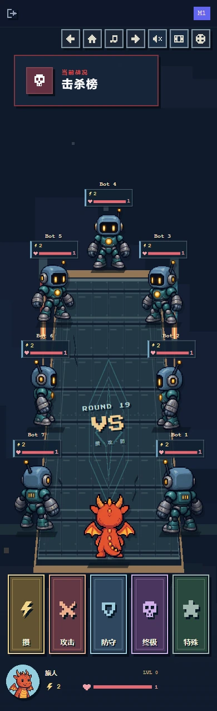

# Centered table seating

Based on the live 2D square-table version at `32a0834aa69edd93d31c4bd1a078d8232bd7f788`.

- The local character stays at the middle of the near edge, directly above the hand, showing its straight back.
- A single opponent stands at the center of the opposite edge.
- For 2–8 players, the distance between consecutive seats is the rendered table perimeter divided by player count. The viewer remains fixed when their index in the room changes.
- All characters face the table center using their existing eight-direction sprites. Facing removes the table's perspective before selecting a sprite.
- Table, feet, card origins and card destinations share the same measured board geometry. Status and controls do not change a character's seat.
- Cards settle on the tabletop around occupied seats. Near-side characters, HP, energy and elevation remain visible.

The existing art, hand cards, battle timing, tutorials and game rules are retained.

## Previews

All screenshots use local fictional players. They are browser viewport simulations, not photographs or an online multiplayer session.

## Validation

- `npm test`: 94 passing tests, including all viewers, equal perimeter spacing, facing, card avoidance, avatar coverage and existing combat behavior.
- `npm run lint -- --max-warnings 0` and `npm run build`: passed.
- Browser layout matrix: 2–8 players in both PLAYING and SHOWDOWN at 1440×1000, 1920×1080, 1200×900, 1199×900, 1024×768, 844×390, 768×1024, 390×844 and 320×700.
- High-stat layouts: energy 120, HP 9.5, elevation 3 and level 23 across nine widths and all player counts.
- Expedition: 25 intent/tooltip cases; all three lessons completed on desktop and mobile, including rewards and shop continuation.
- Hand interaction: keyboard focus, detail dialogs, all categories, disabled/free/temporary cards, a real ultimate cast and settlement, and reduced motion.
- Social controls: six local UI cases, including a scrollable emoji menu on a short landscape viewport. No messages or transactions were sent to an online room.
- All 13 selectable avatar designs were rendered across two mixed-character scenes without missing sprites.

The browser checks inspect actual rendered bounds in addition to the pure layout tests. The final compact results are in [validation.json](validation.json).
