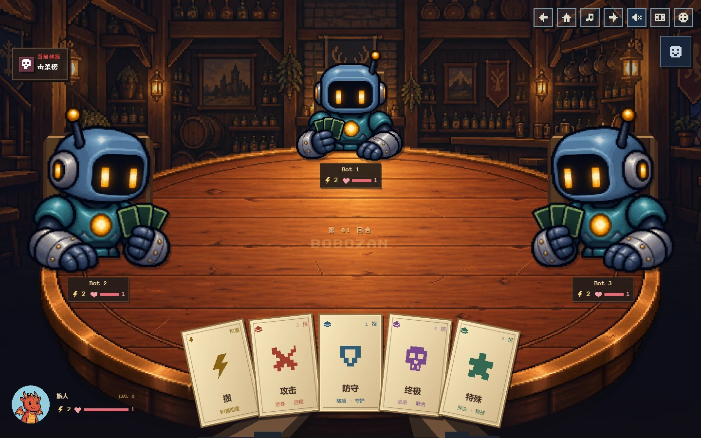
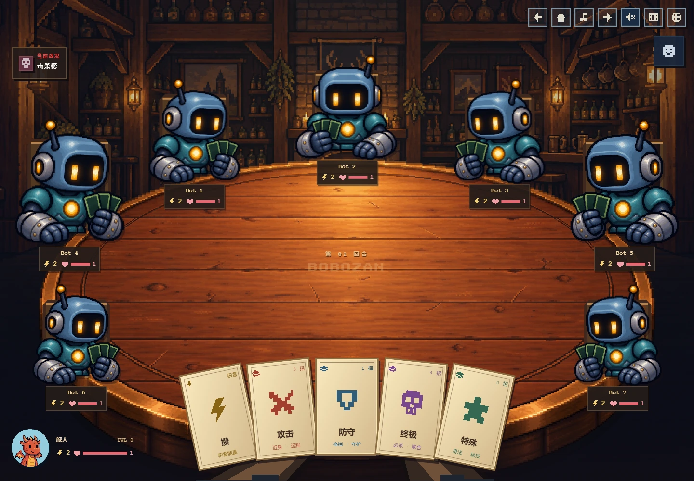
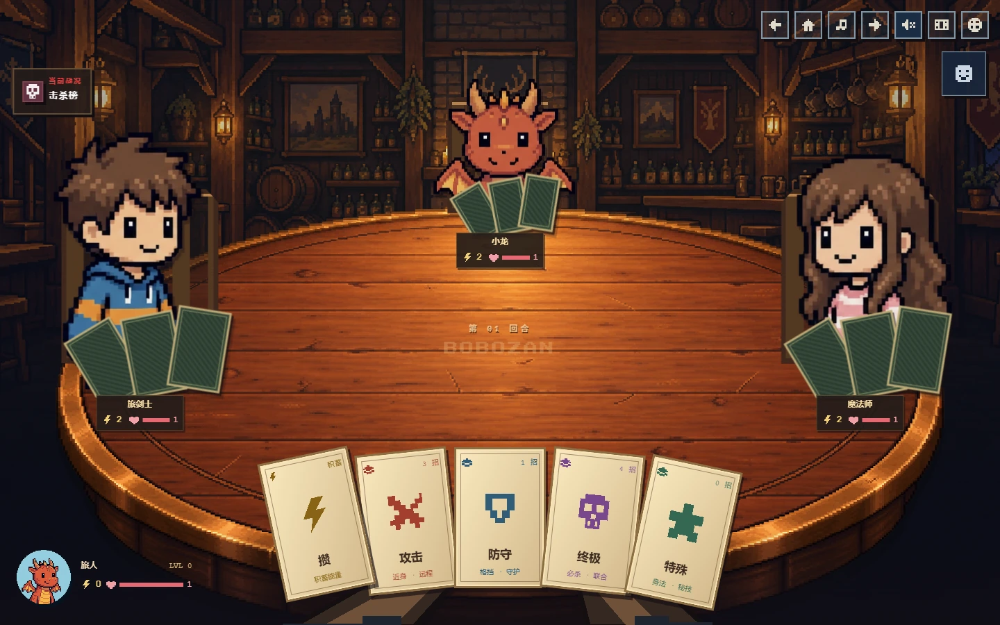
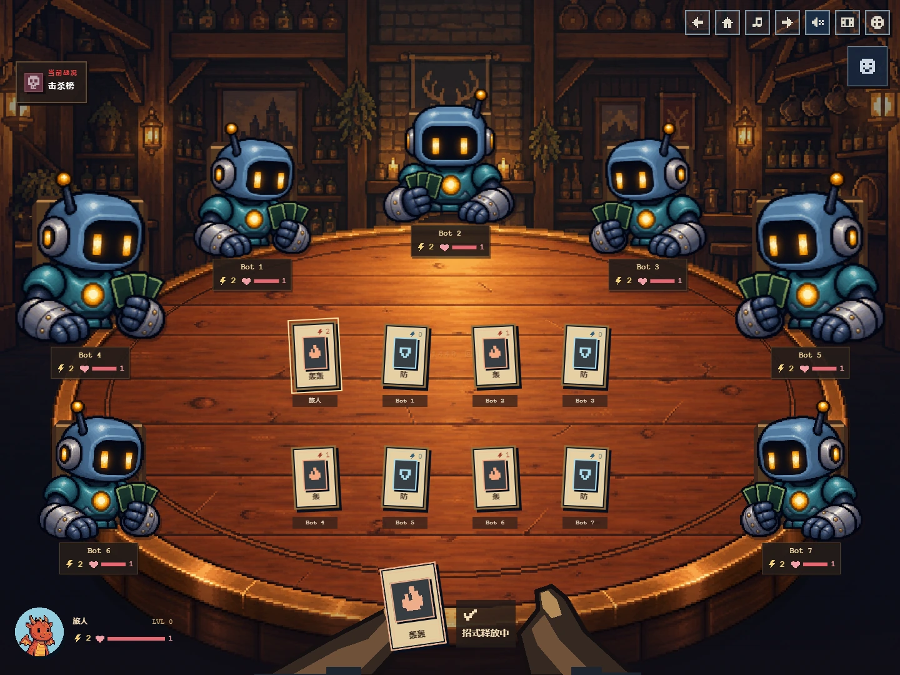

# First-person pixel tavern battle

The battle is now one seated scene: a warm tavern, perspective wooden round table, opponents behind the edge, and a parchment card fan held in the foreground. The player's portrait remains at lower left; expedition inventory remains at lower right.

- New room, table and three-view seated robot assets, generated using the built-in imagegen tool. Runtime WebP exports preserve alpha and every visible source pixel.
- All 37 player/bot/expedition identities remain supported. The robot has bespoke seated art. Other identities use their existing front/quarter atlases framed above the waist with a separate card fan; they have not been replaced by the robot.
- Viewer-relative seating for 2–8 players. First-person hands replace the full-body near-right player model.
- Subtle idle movement, card lift, card flight/landing, hit feedback, and existing ultimate/combo cut-ins. Reduced-motion preferences remain supported.
- Parchment card styling and compact status plates match the table materials. No separate bottom panel or turn-instruction banner.

## Previews

[Four players on mobile](players-4-390.webp) · [Eight players on mobile](players-8-390.webp) · [Expedition on mobile](expedition-390.webp)

## Validation

- Build and ESLint passed; 91 tests passed.
- 63 layout states: 2–8 players at widths 320, 390, 600, 768, 1024, 1199, 1440, 1920 and 3627. No horizontal overflow, clipped category cards, blocked category buttons, status/model intersections, or status/hand intersections.
- 37 identities × 3 orientations loaded; a failed seated robot image falls back to its original robot atlas.
- Four hand-control viewport sizes: category navigation, keyboard focus, disabled/unaffordable skills, free and temporary skills, details dialogs, actual ultimate casting/settlement, reduced motion.
- Three tutorial lessons completed on desktop and mobile, including rewards and shop continuation; a 320×480 details dialog also fits.
- Eight-card reveal tested at five widths, with no card/card or card/status/held-card overlap. Dead moves are excluded; inventory tooltips stay within the viewport.
- Browser scenarios use synthetic local game state. Firebase multi-client networking was not exercised in this UI change.

See the adjacent JSON reports and [asset prompts](ASSET_PROMPTS.md). Preview WebP files use quality-92 compression; original browser PNG captures remain in the local QA folder. Runtime art is lossless. Existing bundle-size/Browserslist warnings remain unchanged.

