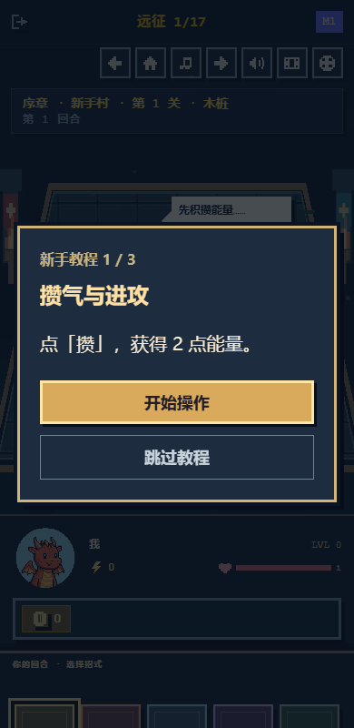
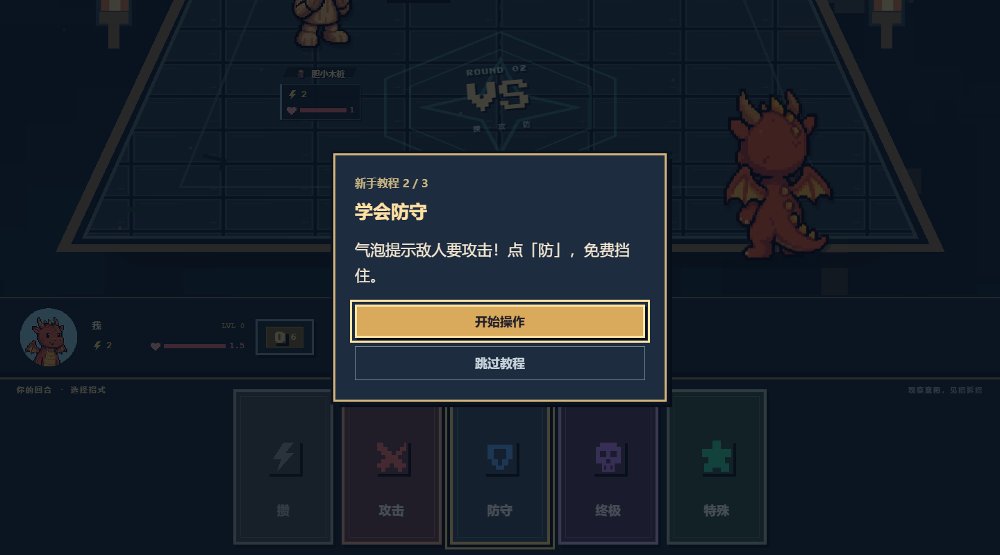
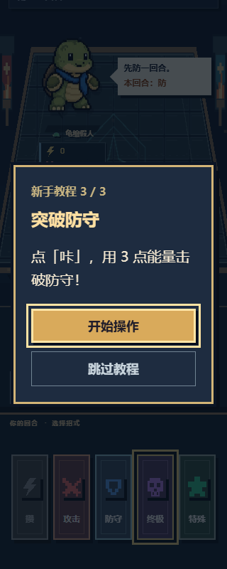

# 大字简短教程弹窗

教程改为居中的像素风弹窗，每步只讲一句当前操作。手机正文 20px、桌面 22px，按钮文字 18px、点击区域至少 48px。移除页面内的长说明面板、课程进度条、重复状态和额外阅读步骤；三课共 8 个实际出牌步骤，小结也缩成一句话。

点击「开始操作」关闭弹窗，打开并聚焦高亮卡牌；玩家仍需亲自点击卡牌或按 Enter / Space 出招。战斗动画期间不弹窗，结算后再显示下一步。「查看提示」可重新打开当前提示，Escape 关闭弹窗并定位卡牌；「跳过教程」立即解除本轮教学限制。

使用原生模态对话框，打开时限制焦点与背景交互，关闭或离开教学时恢复页面滚动。

## 验证

- TypeScript、ESLint、82 项测试及生产构建通过。
- Chromium 在 1440、390、320px 完整走完三课、奖励、商城和第四关。
- 验证弹窗不出牌、卡牌定位、错误牌保护、防守不掉血、结算后继续、跳过、重开、Escape、Tab 焦点及滚动恢复。
- 320 × 480 短屏幕中弹窗可见，无横向溢出；768px 英文、减少动态及 Space 出牌通过。
- 详细结果：[validation.json](validation.json)。保留既有构建的分块体积提示。

## 预览

