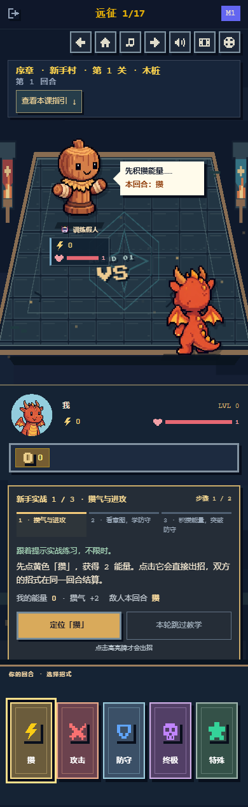
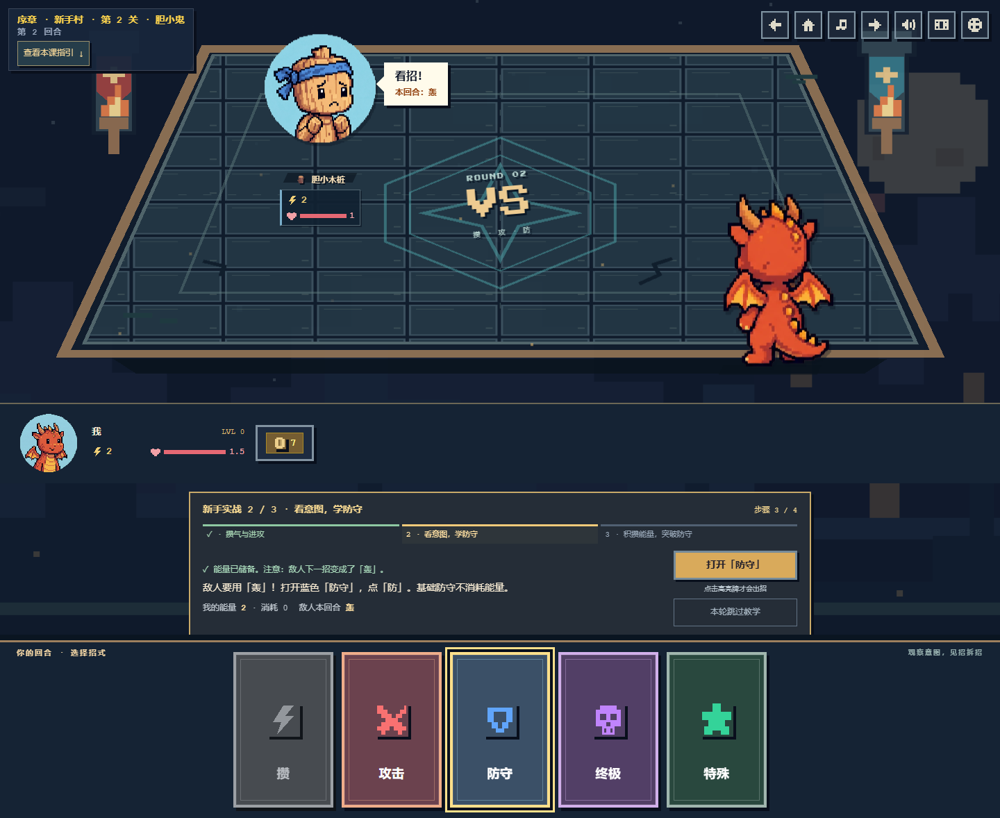
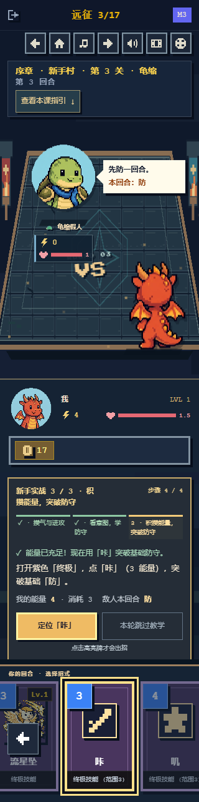
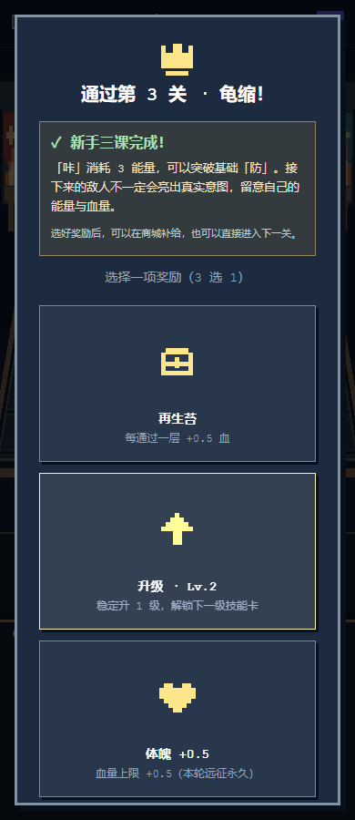

# 三课实战教程

教程沿用像素界面，放在头像状态区与手牌之间，避免遮住战场或玩家头像。关卡信息提供「查看本课指引」入口。

- 三课分别练习攒气与进攻、观察意图与防守、积攒能量与破防。
- 显示课程与步骤进度、上一步结果、当前能量、消耗和敌人本回合招式。
- 「打开／定位」按钮只导航与聚焦手牌；点击卡牌或按 Enter / Space 才会出招。
- 阅读说明不消耗回合；引导期间其他招式不可误出，仍可浏览分类；结算期间暂停引导按钮。
- 跳过教学立即解除限制并更新敌方意图，本轮后续关卡也跳过；新开远征重新开始教学。
- 每课奖励页展示小结，第三课说明后续敌人可能隐藏意图，并解释奖励后进入商城的流程。
- 修正「防守」分类名称及体魄奖励的 +0.5 血量上限说明。战斗数值没有更改。

## 验证

73 项现有及战斗角色回归测试、TypeScript、ESLint 与生产构建通过。

Chromium 在 1440、390、320px 宽度下，通过真实按钮和键盘完整完成三课及奖励、商城、第四关衔接。检查了错误牌保护、定位不出招、阅读不耗回合、防守不掉血、破防胜利、跳过与重开；头像、引导与手牌无相交，页面没有横向溢出或浏览器异常。另在 768px 检查英文、减少动态偏好及 Space 出招。结果见 [validation.json](validation.json)。

复查路径：进入远征 → 查看指引 → 攒 → 轰 → 奖励与商城 → 阅读 → 攒 → 防 → 轰 → 奖励与商城 → 阅读 → 攒两次 → 咔 → 教学小结 → 第四关。每一步都可以先打开其他分类，再使用定位按钮找回目标牌。

## 页面预览

